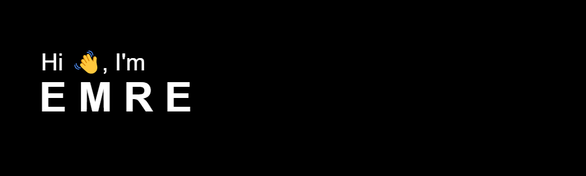
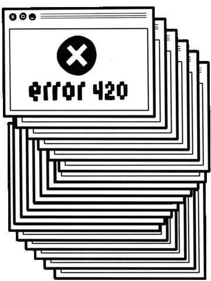

<strong>I am discovering what I can do with some coding plus imagination and this is my diary.Follow the bugs please</strong>:)

  

    
  

  <h2>Languages and Tools</h2>
  

    
    
    
    
    
    
    
    
    
    
    
    
    
    
    
  

 
 
<h1>Contacts</h1>

  
  
  
  

<!--
**soymze/soymze** is a ✨ _special_ ✨ repository because its `README.md` (this file) appears on your GitHub profile.

Here are some ideas to get you started:

- 🔭 I’m currently working on ...
- 🌱 I’m currently learning ...
- 👯 I’m looking to collaborate on ...
- 🤔 I’m looking for help with ...
- 💬 Ask me about ...
- 📫 How to reach me: ...
- 😄 Pronouns: ...
- ⚡ Fun fact: ...
-->
